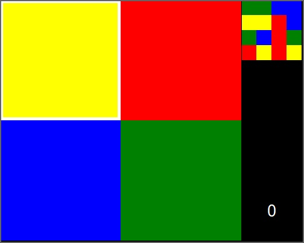

# Python-Puzzle-Game

This is a simple puzzle game in which you have to reproduce the 4x4 pattern by rotating 2x2 cell squares.
## Features
- The game
- Counter of the number of puzzles solved
## Installation
1. Download the repository by clicking on `Code > Download ZIP`
2. Extract the ZIP file
3. Run `main.pyw`
## Requirements
- Python 3.7
- Python `tkinter` library
- Python `random` library
## Usage
You can move the rotating square using the arrow keys and rotate the cells using the spacebar.